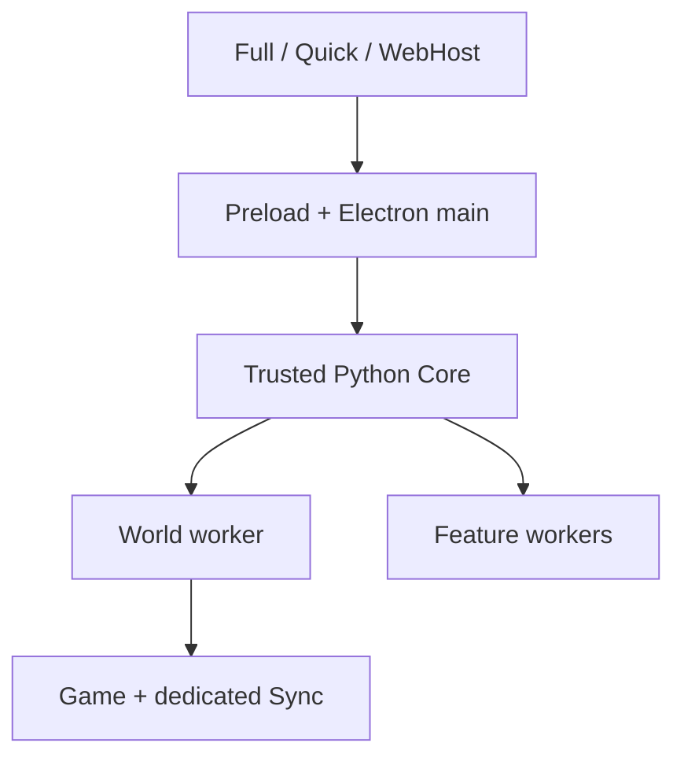

# Current Architecture

## Authority model

The Electron main process owns desktop lifecycle and supervises the trusted Python
Core. The Core owns desired state, validation, secrets, durable writes, runtime
policy, operation locking, and public/security policy. Renderers are untrusted
control surfaces and reach the Core only through the preload/main IPC boundary.

## Execution planes

The World Runtime Worker owns bounded live execution for one hosted World: the
verified desired revision, Dragonwilds child process, logs/watchdog, and dedicated
Sync listener. It cannot silently persist a second authoritative profile.

Feature workers execute bounded expensive operations such as indexing, exchange,
maintenance, client sync, and diagnostics. They use leases, authenticated local
IPC, deadlines, bounded results, and idle shutdown. Losing a feature worker must
not damage durable state.

## Persistence boundary

Before start, the Core validates and performs main-owned mutations, creates an
immutable revisioned snapshot, and asks the worker to verify it. Compatibility
save calls in worker execution are redirected away from durable profile/settings
authority. Secrets are resolved only for the active operation and are not copied
into reports, public payloads, or ordinary configuration.

## Responsiveness boundary

Every UI request has a bounded renderer and Electron-main deadline, with longer
policies for backup/update/sync work. A timeout alone is insufficient because it
does not yet cooperatively cancel work in Core. Long operations still require a
propagated request identity, cancellation, progress/heartbeat, bounded subprocess
I/O, and guaranteed cleanup. The serial Core dispatcher remains an explicit
freeze-audit target until those guarantees are demonstrated by the matrix.

## Network boundary

Installation presence and per-World publication are separate. World publication
uses stable identity, unique credentials, exact-body timestamped signatures,
allowlisted public fields, retry/backoff, and independent destinations. Public
directory discovery never grants Remote Admin authority.

See [`../docs/SYSTEMS.md`](../docs/SYSTEMS.md) for component ownership and
[`../docs/KNOWN_LIMITATIONS.md`](../docs/KNOWN_LIMITATIONS.md) for current gaps.
